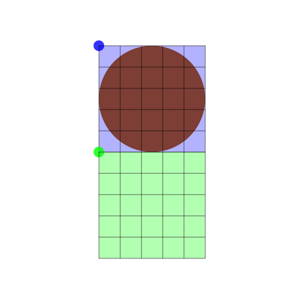

# iOS Training Log - Drawing striped overlays onto a bubble visualization

## Bubble Definition/Background

Strava recently shipped the (previously web & Android only) Training Log to iOS devices, which represents the athlete's previous activities using bubbles.

A "bubble", in the context of this post, shows the accumulated volume of some activity dimension (distance, time, etc.) for a given day. This will add up the athlete's chosen dimension for all activities on a particular day and translate that to a percentage. This percentage is piped into a scaling algorithm to determine the ideal bubble size.

After sizing, athlete-selected filters and activity tags can alter the bubble's appearance or add a visual adornment on top of the bubble's view. For the purposes of this post, let's focus on the "workout" tag that can be applied an activity. This will create a bubble with a striped overlay.


## How to Draw a Bubble

This is the simplest part of the bubble view's drawing since we can heavily lean on `UIKit` to do most of the heavy lifting. First off, we'll create a subclass of `UIView` to be the bubble visualization.

```Swift
final class BubbleView: UIView {
    override func draw(_ rect: CGRect) { ... }
}
```

This subclass will override the `draw(rect:)` method to create a simple circle in the current context. To make our code more readable, let's create a function in an extension to `BubbleView` to handle drawing the bubble and call it from the `draw(rect:)` implementation.

```Swift
extension BubbleView {
    func drawBubble(in bubbleBounds: CGRect, bubbleColor: UIColor) {
        // 1.
        guard let context = UIGraphicsGetCurrentContext() else { return }
        // 2.
        context.setFillColor(bubbleColor.cgColor)
        // 3.
        context.fillEllipse(in: bounds)
    }
}

final class BubbleView: UIView {
    override func draw(_ rect: CGRect) {
        drawBubble(in: bounds, bubbleColor: .orange)
    }
}
```

1. Capture the current context.
2. Set the fill of the context to the provided color (`.orange` in this case) which will be used in the next operation.
3. Fill an ellipse (which will end up as a circle if the view has a 1:1 aspect ratio) with the previously set color.


Easy enough thanks mostly to `UIKit`. Let's move on to the striped overlay now.

## Draw Stripes Over the Bubble at a 45° Angle

We _could_ calculate the start/end points of all the stripes using various geometry tricks but that's difficult. Instead, let's explore an easier way by once again leaning on `UIKit` for the heavy lifting. To set up the scaffolding, let's add to the extension to `BubbleView` that allows an instance to easily draw this overlay and call it from our original `draw(rect:)` implementation.

```Swift
extension BubbleView {
    /// Draws a set of stripes across the view up from bottom left
    /// to top right at a 45 degree angle. The stripes will be
    /// `stripeWidth` wide and have `stripeWidth` between them.
    func drawStripes(in bubbleBounds: CGRect,
                     stripeColor: UIColor,
                     stripeWidth: CGFloat) {...}
}

final class BubbleView: UIView {
    override func draw(_ rect: CGRect) {
        drawBubble(in: bounds, bubbleColor: .orange)

        // Arbitrarily size the size as 1/10th the maximum radius.
        let stripeWidth = bounds.width / 2.0 * 0.1

        drawStripes(in: bounds,
                    stripeColor: UIColor.black.withAlphaComponent(0.3),
                    stripeWidth: stripeWidth)
    }
}
```

Notice the call to `drawStripes(in:stripeColor:stripeWidth:)` is _after_ the call to `drawBubble(in:bubbleColor:)`. This is because each context-based drawing operation is stacked on the previous and we'd like the bubble to be beneath the overlay.

Next, we'll move into the stripe drawing function and fill in some sizing code. This will be explained a bit more later.

```Swift
extension BubbleView {
    func drawStripes(in bubbleBounds: CGRect,
                     stripeColor: UIColor,
                     stripeWidth: CGFloat) {
        guard let context = UIGraphicsGetCurrentContext() else { return }

        // Current radius of the bubble that the stripes should cover.
        // This allows us to draw/clip less stripes since we avoid
        // drawing outside the bubble.
        let bubbleRadius = bubbleBounds.width / 2.0

        // This should be the maximum the stripes would need to be to span
        // from one along the entire diagonal of the bounds. This is
        // supposed to calculate the hypotenuse of the two triangles that
        // form the rectangle.
        let maxPathLength = sqrt(pow(bubbleBounds.width, 2) + pow(bubbleBounds.height, 2))

        ...
    }
}
```

This code snippet takes advantage of `CGContext.translateBy(x:,y:)` and `CGContext.rotate(by:)` to drastically simplify our drawing code. But first, let's visualize the context's current coordinate system. The blue grid represents the context's theoretical bounds and the darker blue dot represents the context's origin.


By translating the context downward, we can get the origin closer to where we want to begin drawing the stripes.

```Swift
// Translate corner to bottom of rectangle.
context.translateBy(x: 0, y: bubbleBounds.height)
```

The resulting coordinate system has now been shifted such that the origin is at the bottom of the previous grid. The shifted coordinate system for the context is represented in the new green grid.



After this translation, we now need to rotate the context so that drawing a straight line on it will be at a 45° angle to our original context position. This is done by rotating the context around the origin (top-left) of the user coordinate system. This takes into account all previous coordinate mutations, which is just a translation in our case.

```
// Rotate around corner
context.rotate(by: CGFloat.pi * -45.0 / 180.0)
```

The resulting coordinate system has been rotated 45° around the previous green origin. The new red user coordinate system has replaced the green coordinate system and is the current drawing coordinate system visualized. The original blue grid still remains as a visual reference for illustration purposes.


At this point, the red dot on the red grid illustrates position `(0,0)` or the origin. The `x` direction extends away from it upward on the 45° line while the `y` direction extends downward on the opposing 45° line. Before we are able to begin drawing the stripes in our new user coordinate space, we first need to ensure they are styled correctly.

```Swift
// set line attributes
context.setLineWidth(stripeWidth)
context.setStrokeColor(stripeColor.cgColor)
```

So, to draw the middle strip at this point, we use `maxPathLength` (our previous calculation for stripe length) for the length and draw it from our origin.

```Swift
// Now that we've shifted the canvas around, (0,0) from left to right now
// goes from bottom-left to top-right of the original rectangle. Stroke
// the middle stripe first since it has no mirror.
context.move(to: CGPoint(x: 0, y: 0))
context.addLine(to: CGPoint(x: maxPathLength, y: 0))
context.strokePath()
```

This will stroke a stripe centered on the x-axis of the previously defined width (`stripeWidth`).


This initial stripe has no mirror since it occurs on the x-axis or center of the circle. All the other stripes have stripes mirrored over the x-axis, which is centered beneath the initial stripe above.

We can iterate over the entire width of our bubble drawing these mirrored stripes on each pass until we reach, or exceed, the edge of the bubble.

```Swift
// Add all the stripes on top and bottom of the middle at the same time.
// Continue adding until we are outside of the bubble's radius since
// this area is clipped anyway.
var index = 1
// This calculation determines if the edge of the stripe (center of the current
// stripe minus half the stripe width) is within the bubble's radius.
while (CGFloat(index) * stripeWidth * 2) - (stripeWidth / 2.0) < bubbleRadius {
    let offset = CGFloat(index) * stripeWidth * 2

    // above the middle
    context.move(to: CGPoint(x: 0, y: offset))
    context.addLine(to: CGPoint(x: maxPathLength, y: offset))
    context.strokePath()

    // below the middle
    context.move(to: CGPoint(x: 0, y: -offset))
    context.addLine(to: CGPoint(x: maxPathLength, y: -offset))
    context.strokePath()

    index += 1
}
```

This results in a series of stripes above and below (in the user coordinate space) our initial center stripe.


To make it easier to grasp what we currently have in our context without the grids, let's remove them.


This is close to what we are trying to accomplish except for the fact that the stripes extend past the edges of the bubble. To easily solve this problem, we need to use the bubble's radius to apply a clip to the context before we start drawing any of the stripes and before we mutate the user coordinate space.

```Swift
// Clip to bubble bounds since none of the stripes should be
// drawn outside of the provided bubble bounds.
let path = CGMutablePath()
path.addArc(center: CGPoint(x: bounds.midX, y: bounds.midY),
            radius: bubbleRadius,
            startAngle: 0,
            endAngle: 2 * CGFloat.pi,
            clockwise: true)
context.addPath(path)
context.clip()
```

This clip path, when applied to the context before the drawing, will clip all of the stripes that extend past the edge of the bubble.


And there we have it, an easy way to draw lots of stripes at odd angles without having to do geometry calculations other than converting the degree measurements to radians. :P

## Final Code

```Swift
extension BubbleView {
    /// Draws a set of stripes across the view up from bottom left
    /// to top right at a 45 degree angle. The stripes will be
    /// `stripeWidth` wide and have `stripeWidth` between them.
    func drawStripes(in bubbleBounds: CGRect,
                     stripeColor: UIColor,
                     stripeWidth: CGFloat) {
        guard let context = UIGraphicsGetCurrentContext() else { return }

        // Current radius of the bubble that the stripes should cover.
        // This allows us to draw/clip less stripes since we avoid
        // drawing outside the bubble.
        let bubbleRadius = bubbleBounds.width / 2.0

        // This should be the maximum the stripes would need to be to span
        // from one along the entire diagonal of the bounds. This is
        // supposed to calculate the hypotenuse of the two triangles that
        // form the rectangle.
        let maxPathLength = sqrt(pow(bubbleBounds.width, 2) + pow(bubbleBounds.height, 2))

        // Clip to bubble bounds since none of the stripes should be
        // drawn outside of the provided bubble bounds.
        let path = CGMutablePath()
        path.addArc(center: CGPoint(x: bounds.midX, y: bounds.midY),
                    radius: bubbleRadius,
                    startAngle: 0,
                    endAngle: 2 * CGFloat.pi,
                    clockwise: true)
        context.addPath(path)
        context.clip()

        // Translate corner to bottom of rectangle.
        context.translateBy(x: 0, y: bubbleBounds.height)

        // Rotate around corner
        context.rotate(by: CGFloat.pi * -45.0 / 180.0)

        // set line attributes
        context.setLineWidth(stripeWidth)
        context.setStrokeColor(stripeColor.cgColor)

        // Now that we've shifted the canvas around, (0,0) from left to right now
        // goes from bottom-left to top-right of the original rectangle. Stroke
        // the middle stripe first since it has no mirror.
        context.move(to: CGPoint(x: 0, y: 0))
        context.addLine(to: CGPoint(x: maxPathLength, y: 0))
        context.strokePath()

        // Add all the stripes on top and bottom of the middle at the same time.
        // Continue adding until we are outside of the bubble's radius since
        // this area is clipped anyway.
        var index = 1
        while (CGFloat(index) * stripeWidth * 2) - (stripeWidth / 2.0) < bubbleRadius {
            let offset = CGFloat(index) * stripeWidth * 2

            // above the middle
            context.move(to: CGPoint(x: 0, y: offset))
            context.addLine(to: CGPoint(x: maxPathLength, y: offset))
            context.strokePath()

            // below the middle
            context.move(to: CGPoint(x: 0, y: -offset))
            context.addLine(to: CGPoint(x: maxPathLength, y: -offset))
            context.strokePath()

            index += 1
        }
    }

    func drawBubble(in bubbleBounds: CGRect,
                    bubbleColor: UIColor) {
        guard let context = UIGraphicsGetCurrentContext() else { return }
        context.setFillColor(UIColor.orange.cgColor)
        context.fillEllipse(in: bounds)
    }
}

final class BubbleView: UIView {
    override func draw(_ rect: CGRect) {
        drawBubble(in: bounds, bubbleColor: .orange)

        // Arbitrarily size the size as 1/10th the maximum radius.
        let stripeWidth = bounds.width / 2.0 * 0.1

        drawStripes(in: bounds,
                    stripeColor: UIColor.black.withAlphaComponent(0.3),
                    stripeWidth: stripeWidth)
    }
}
```
